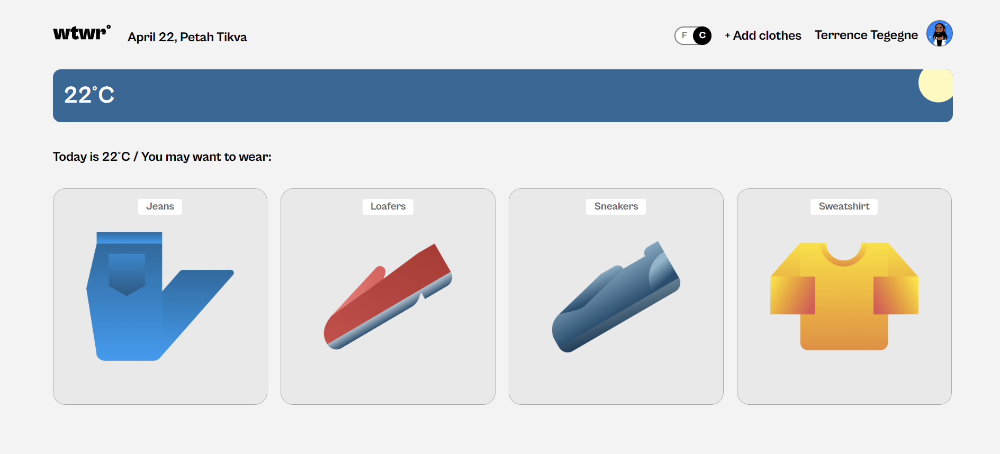
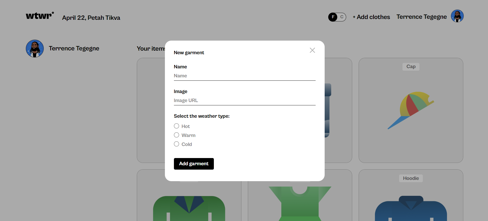
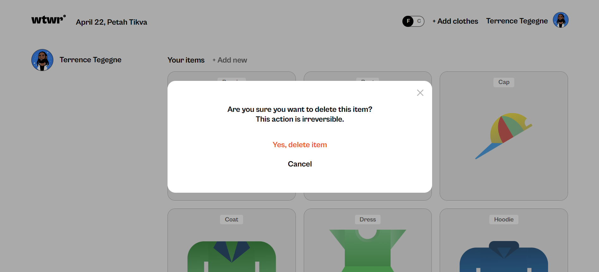
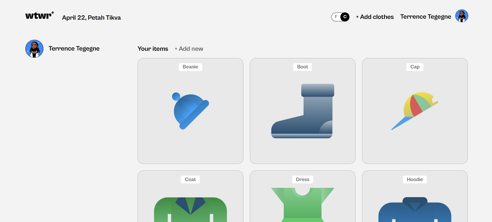

# Project 4: WTWR (What to Wear)

"WTWR" is the fourth project in the Software Engineer program at TripleTen.
It is an application that gives out clothing suggestions based on temperature data retrieved from a weather API.

## Project Features

- React contexts
- React routes
- React hooks
- Flat BEM file structure
- API requests

## Project's screenshots

## Link to the Backend

[Backend Repository](https://github.com/Dayana-Pugachov/se_project_express)
